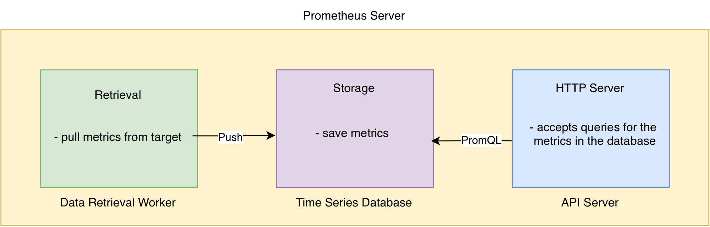
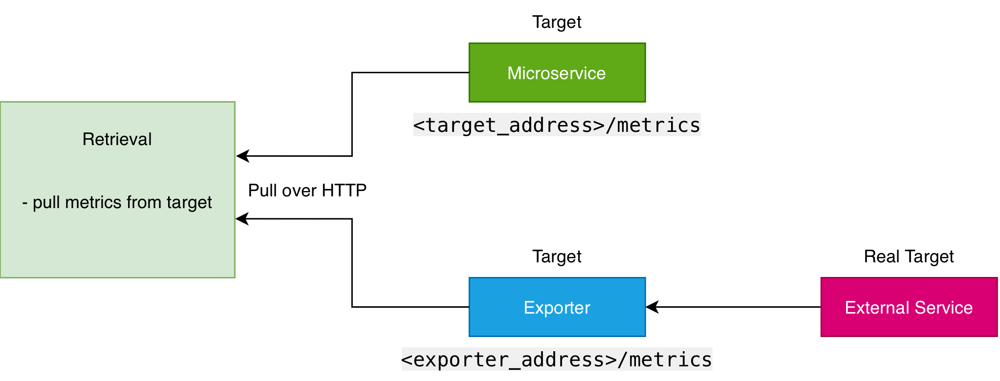
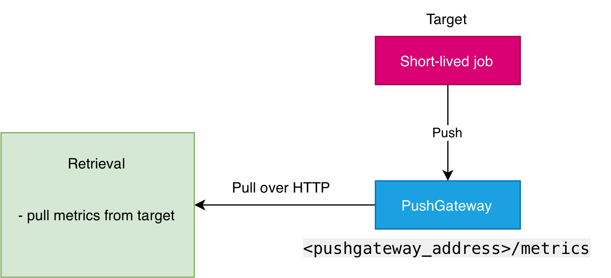
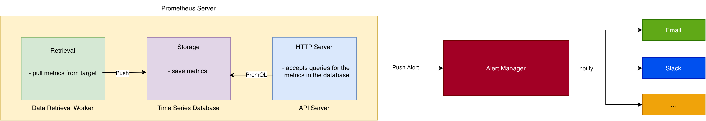

<h1 align="center"> Supporto OpenShift </h1>

Questa repo contiene i vari esercizi e task assegnati nella track 4.

### Step 1

1. Comprendere in profondità la composizione del manifest che descrive un Deployment e un DeploymentConfig
2. Creare un deployment che installi Nginx o un'applicazione con footprint minimale

#### Deployment vs DeploymentConfig 

Le differenza principale tra `Deployment` e `DeploymentConfig` è il modo in cui viene attivato e gestito l'aggiornamento(`rollout`): 
   
   1. Il DeploymentConfig può monitorare un `ImageStream`, cioè un registro interno di OpenShift. Quando viene aggiornata l'immagine di un container, il DeploymentConfig se ne accorge in automatico e avvia un aggiornamento dei pod. 
   
   2. Il DeploymentConfig permette di eseguire comandi o pod "temporanei" in momenti precisi del ciclo di vita del deployment:
      - `Pre-hook`: Esegue un'azione prima che i nuovi pod vengano avviati (es. eseguire le migrazioni di un database). Se il pre-hook fallisce, l'aggiornamento si blocca subito.
      - `Post-hook`: Esegue un'azione dopo che l'aggiornamento è terminato con successo (es. inviare una notifica Slack o pulire la cache).

#### Nginx Deployment 

Per fare un deployment con `footprint minimale` deobbiamo dare all'applicazione le risorse minime che garantiscono comunque il corretto funzionamento. 

In generale vanno seguite le seguenti regole:
- `RAM Request`: Impostata pari al consumo medio reale dell'applicazione.
- `RAM Limit`: Impostata con un margine di sicurezza del 20-30% rispetto al picco massimo atteso. La RAM non è una risorsa comprimibile: se finisce, il pod va in crash.
- `CPU Request`: Impostata pari al consumo medio a regime.
- `CPU Limit`: Può essere lasciata `2×Request` o `3×Request` per gestire i picchi di avvio, oppure omessa del tutto per evitare il fenomeno del `Throttling` della CPU su carichi pesanti.

Quindi nel caso del deployment di un web server nginx posso mettere:

```yaml
resources:
  requests:
    memory: "32Mi" 
    cpu: "50m"
  limits:
    memory: "64Mi"
    cpu: "100m" 
```

---

### Step 2

1. Creare ROOT CA self-signed e locale
2. Creare CSR
3. Rilasciare i certificati richiesti dal CSR tramite ROOT CA creata nel punto 1

#### Creazione Root CA self-signed e locale

Per la `Root CA` dobbiamo generare prima una `chiave privata` e poi il certificato auto-firmato (self-signed).

Per generare la chiave privata possiamo usare `openssl`:

```bash
openssl genrsa -aes256 -out rootCA.key 4096
```

- `genrsa`: Algoritmo di cifratura RSA.
- `-aes256`: Cifra la chiave con password (AES-256).
- `-out rootCA.key`: Specifica il nome del file di output in cui verrà salvata la chiave privata.
- `4096`: Dimensione della chiave in bit (alta sicurezza).

Quindi alla fine di questo comando otterò la chiave privata nel file `rootCA.key`.

Per generare il certificato possiamo ancora usare `openssl`:

```bash
openssl req -x509 -new -nodes -key rootCA.key -sha256 -days 3650 -out rootCA.crt
```

- `-x509`: Genera un certificato auto-firmato definitivo.
- `-new`: Genera una nuova richiesta/certificato da zero.
- `-nodes`: Disabilita la cifratura del certificato pubblico finale, rendendolo leggibile senza richiedere password quando viene importato dai client.
- `-key rootCA.key`: Specifica la chiave privata da utilizzare per firmare questo certificato.
- `-sha256`: Algoritmo di hash sicuro.
- `-days 3650`: Validità del certificato (10 anni).
- `-out rootCA.crt`: Specifica il nome del file di output per il certificato pubblico.

Alla fine di questo comando otterò il certifiacto pubblico `rootCA.crt` della CA locale. 


#### Creazione CSR

Il CSR (`Certificate Signing Request`) è la richiesta che un server/servizio invia alla CA per farsi firmare il certificato.

Come prima cosa devo generare la chiave privata per il server/servizio:

```bash
openssl genrsa -out server.key 2048
```

Ora possiamo generare il CSR a partire dalla chiave del server:

```bash
openssl req -new -key server.key -out server.csr
```

Otteniamo cosi `server.key` (chiave del server) e `server.csr` (il file da inviare alla CA).

#### Rilascio certificato tramite Root CA

Ora la Root CA locale riceve il CSR, lo firma e rilascia il certificato `.crt` valido per il server.

Per firmare il certificato:
```bash
openssl x509 -req -in server.csr -CA rootCA.crt -CAkey rootCA.key -CAcreateserial -out server.crt -days 365 -sha256 
```

Otteniamo `server.crt` pronto per essere installato sul server.

---

### Step 3

1. Comprendere in profondità il manifest che descrive una ResourceQuota
2. Applicare Quotas e verificarne l'effettivo funzionamento al superamento delle soglie indicate

#### ResourceQuota

Le `ResourceQuota` sono risorse di Kubernetes/OpenShift definite a livello di Namespace per limitare il consumo complessivo di risorse da parte di tutti i pod e gli oggetti presenti in quel determinato `namespace`.

In particolare stabiliscono il `soffitto massimo` per l'intero Namespace.

Le ResourceQuota non limitano solo la `memoria` e la `CPU`, ma possono controllare tre categorie principali:
- `Risorse Computazionali`: requests.cpu, limits.cpu, requests.memory, limits.memory.
- `Numero di Oggetti (Count Quotas)`: pods, services, configmaps, secrets, persistentvolumeclaims.
- `Storage`: requests.storage (spazio totale su disco che il namespace può richiedere).

##### Come funzionano le ResourceQuota nel cluster

- `Admission Control`: A ogni richiesta di creazione di un nuovo Pod, il cluster calcola la somma tra le risorse già occupate nel namespace e quelle richieste dal nuovo Pod (requests / limits).
- `Enforcement (Blocco immediato)`: Se la somma supera la soglia definita nella quota, l'`Admission Controller` rifiuta la richiesta restituendo un errore `HTTP 403 (Forbidden)`.
- `Obbligatorietà dei Limiti`: L'attivazione di una ResourceQuota su CPU o RAM impone che ogni Pod nel namespace specifichi esplicitamente le sezioni requests e limits nel proprio manifest YAML; in caso contrario, il deployment viene bloccato a prescindere.

##### quota.yaml

```yaml
apiVersion: v1
kind: ResourceQuota
metadata:
  name: quota-mem-cpu-track4
  namespace: ns-track4
spec:
  hard:
    requests.cpu: "1"      
    requests.memory: "256Mi" 
    limits.cpu: "2"          
    limits.memory: "512Mi"  
    pods: "3" 
```

Per testare il funzionano possiamo fare:

1. Creo e applico la ResourceQuota
  
```bash
kubectl apply -f quota.yaml
```

2. Verifico lo stato iniziale della Quota

```bash
kubectl get resourcequota quota-mem-cpu-track4 -n ns-track4
```

3. Creo un primo Deployment valido

```bash
kubectl apply -f deployment-nginx.yaml
```

Posso verficare se il pod si avvia correttamente. Se ri-eseguo `kubectl get resourcequota`, posso vedere che la voce `USED` si è aggiornata (requests.memory: 32Mi/256Mi).

4. Forzo il fallimento della Quota

Provo a scalare il deployment a 10 repliche per superare la quota impostata (pods: "3" o requests.memory: 256Mi):

```bash
kubectl scale deployment deployment-nginx --replicas=10 -n ns-track4
```

Poi analizzare cosa è successo guardando gli eventi del sistema:

```bash
kubectl get events -n ns-track4 --field-selector reason=FailedCreate
```

Quello che osservo è un messaggio di errore generato dal `ReplicaSet` simile a questo:

```bash
Error creating: pods "deployment-nginx-..." is forbidden: exceeded quota: quota-mem-cpu-track4, requested: requests.memory=32Mi, used: 256Mi, limited: 256Mi
```

Il cluster ha bloccato la creazione dei pod in eccesso, lasciando attivi solo quelli che rientravano nel budget.

---

### Step 4 

1. Installare Prometheus Stack tramite helm chart ufficiale (https://github.com/prometheus-community/helm-charts/tree/main/charts/kube-prometheus-stack)
2. Comprendere tutti gli elementi dello Stack (Prometheus, AlertManager, Grafana e il NodeExporter)
3. Provare il BlackBox Exporter per il monitoring di endpoint http
4. Visionare e comprendere le dashboard installate dall'operator nel punto 1

#### Cos'è Prometheus?

Prometheus è un sistema di `monitoraggio` e `alerting` `time-series` open source, progettato per raccogliere ed elaborare le metriche di applicazioni e infrastrutture cloud-native.

Prometheus organizza il monitoraggio attraverso tre concetti chiave:

* `Target`: È l'entità monitorata. Può essere un sistema operativo (server Linux/Windows), un web server (es. Apache), un database o una singola applicazione/servizio.
* `Metriche`: Rappresentano i singoli parametri e indicatori raccolti da un Target (es. utilizzo di CPU, RAM e disco, oppure il numero di eccezioni/errori applicativi).
* `Time-Series Database`: Tutte le `metriche` raccolte dai Target vengono memorizzate nel database interno di Prometheus per l'analisi e lo storico.

#### Architettura e Componenti Principali




Il server Prometheus ha al suo interno tre componenti chiave:

* `Data Retrieval Worker`: Si occupa di raccogliere (*pull*) le metriche esposte dai vari Target e di salvarle direttamente nel database locale.
* `Time Series Database (TSDB)`: Memorizza le metriche in un formato ottimizzato per le serie temporali (*time series*), organizzando i dati per nome della metrica, timestamp e coppie chiave-valore (etichette).
* `API Server`: Gestisce le query scritte in `PromQL` (*Prometheus Query Language*) per accedere ai dati memorizzati. Serve l'interfaccia web integrata di Prometheus per la visualizzazione rapida e si integra nativamente con strumenti avanzati di dashboarding come `Grafana`.


#### Tipi di Metrica in Prometheus

Ogni metrica include gli attributi `# HELP` (descrizione) e `# TYPE` (tipologia di dato).

| TIPO | COMPORTAMENTO | ESEMPI TIPICI |
| :--- | :--- | :--- |
| Counter | Può solo `incrementare` (o resettarsi). | Numero di richieste HTTP, totale eccezioni. |
| Gauge | Può `salire e scendere`. | Percentuale CPU, consumo RAM, temperatura. |
| Histogram | Misura la `distribuzione/durata` di un evento in *bucket*. | Latenza delle richieste HTTP, tempo di risposta del DB. |


#### Meccanismo di Raccolta (Scraping) metriche



* **Protocollo:** HTTP / HTTPS
* **Endpoint standard:** `<target_address>/metrics`
* **Flusso:** Il *Data Retrieval Worker* esegue una richiesta GET all'endpoint `/metrics` del target, leggendo le metriche nel formato testuale standard.
* **Compatibilità (Exporter):** Se il sistema da monitorare non supporta nativamente l'endpoint `/metrics`, si affianca al target un **Exporter** (es. *Node Exporter* per i server OS, *MySQL Exporter* per i database) che prende le metriche dal Target, converte le metriche nel formato giusto e poi le espone al *Data Retrieval Worker*. 

###### Node Exporter

Il `Node Exporter` è il componente standard utilizzato per il monitoraggio dell'infrastruttura e dei sistemi operativi (Linux/Unix). 

Ha il compito di raccogliere le metriche a basso livello della macchina su cui è installato e di convertirle nel formato compatibile con Prometheus:

* `Funzionamento:` Gira come servizio in background sul server da monitorare ed espone le metriche sulla porta predefinita `9100` (all'indirizzo `/metrics`).
* `Metriche monitorate:`
  * `Risorse di calcolo:` Utilizzo CPU, carico di sistema (*load average*).
  * `Memoria:` Consumo e disponibilità di RAM e Swap.
  * `Storage:` Spazio su disco disponibile/usato e prestazioni di I/O (Read/Write).
  * `Rete:` Traffico in ingresso/uscita e stato delle interfacce.

###### Modello Pull

A differenza di molti sistemi di monitoraggio tradizionali basati su un'architettura `Push`, dove ogni target esegue un agente o un demone che invia continuamente i dati verso il server, generando un traffico di rete costante e imprevedibile, Prometheus adotta un approccio `Pull`.

In questo modello è il server di Prometheus a gestire attivamente la raccolta: a intervalli regolari effettua una richiesta `HTTP` agli endpoint dei vari target per leggere le metriche esposte. Questo approccio non solo riduce lo stress sulla rete, ma rende l'architettura estremamente flessibile. È infatti possibile affiancare più istanze di Prometheus in parallelo che interrogano gli stessi target (garantendo ridondanza) oppure distribuire il carico tra più server per poi federare i dati.

###### Federazione in Prometheus 

La Federazione in Prometheus è un meccanismo che permette a un server Prometheus (detto Prometheus Globale) di recuperare ed estrarre (scraping) metriche selezionate da altri server Prometheus (detti Prometheus Locali).

###### Gestione dei Target Temporanei: Il Pushgateway

Il modello `Pull` di Prometheus presenta un limite con i processi a breve durata (definiti `short-lived jobs` o `ephemeral targets`), come gli script batch o i task automatizzati. Questi processi possono avviarsi, completare il loro lavoro e terminare prima che il server Prometheus abbia il tempo di effettuare lo *scraping* (intervallo di pull).




Per risolvere questo problema si utilizza il `Pushgateway`:

1. `Push dalle applicazioni:` Durante o alla fine della sua esecuzione, il processore temporaneo invia (*push*) le sue metriche al Pushgateway tramite `API HTTP`.
2. `Persistence:` Il Pushgateway conserva le metriche ricevute in memoria.
3. `Pull di Prometheus:` Prometheus effettua il normale *pull* periodico dall'endpoint del Pushgateway come se fosse un comune target, recuperando le metriche dei job ormai terminati.

> ⚠️ **Nota:** Il Pushgateway non deve essere usato come scusa per trasformare Prometheus in un sistema Push globale. Va utilizzato unicamente per job temporanei ed effimeri dove il meccanismo Pull diretto non è fisicamente applicabile.

### Alert Manager

